# Projektdokumentation – PT-Karteikarten

## Inhaltsverzeichnis

1. [Ausgangslage](#1-ausgangslage)
2. [Lösungsidee](#2-lösungsidee)
3. [Vorgehen & Artefakte](#3-vorgehen--artefakte)
    1. [Understand & Define](#31-understand--define)
    2. [Sketch](#32-sketch)
    3. [Decide](#33-decide)
    4. [Prototype](#34-prototype)
    5. [Validate](#35-validate)
4. [Erweiterungen](#4-erweiterungen)
5. [Projektorganisation [Optional]](#5-projektorganisation-optional)
6. [KI-Deklaration](#6-ki-deklaration)
7. [Anhang [Optional]](#7-anhang-optional)

> **Hinweis:** Massgeblich sind die im **Unterricht** und auf **Moodle** kommunizierten Anforderungen.

<!-- WICHTIG: DIE KAPITELSTRUKTUR DARF NICHT VERÄNDERT WERDEN! -->

---

## 1. Ausgangslage

Studierende nutzen Karteikarten zum Lernen, verlieren dabei aber häufig den direkten Bezug zur Vorlesungsquelle. Ist die Antwort-Seite in der Karteikarte unklar oder unzureichend für das Verständnis, muss manuell in Folien oder Notizen gesucht werden. Dies ist ein zeitaufwendiger Medienbruch, der den Lernfluss unterbricht und zu Frustration führt.

- **Problem:** Beim Lernen mit Karteikarten fehlt der direkte Rückbezug zu Semesterwoche und Vorlesungsfolie. Die Antwort einer Karte ist sichtbar, aber nicht sofort klar, in welcher Semesterwoche oder auf welcher Folie das Thema behandelt wurde. Dadurch entstehen Suchaufwand, Unsicherheit und Medienbrüche beim Lernen.
- **Ziele:**
  - Karteikarten schnell und einfach erstellen mit Pflichtfeldern Frage, Antwort, Woche und Folie/Seite.
  - Beim Lernen direkt zur ursprünglichen Vorlesungsquelle zurückfinden, ohne lange suchen und recherchieren zu müssen.
  - Übersichtliche Verwaltung der Karten nach Stapel, Woche und Quelle.
- **Primäre Zielgruppe:** Studierende an Hochschulen, die mit digitalen Karteikarten lernen und ihre Unterlagen nach Modul, Semesterwoche oder Vorlesung strukturieren.
- **Weitere Stakeholder [Optional]:** Dozierende, die durch strukturiertes Lernmaterial (Aufbau des Moduls nach Semesterwochen) profitieren könnten.

---

## 2. Lösungsidee

Eine schlanke Karteikarten-Web-App, bei der jede Karte explizit mit Semesterwoche und Vorlesungsfolie verknüpft ist. Anstatt komplexer Strukturen steht eine einfache Dashboard-Ansicht mit Filterfunktionen im Fokus.

- **Kernfunktionalität:**
  - **Workflow A – Karte erstellen und bearbeiten:** Anmelden → Stapel öffnen → Formular ausfüllen (Frage, Antwort, Woche, Folie; optional Screenshot per Drag & Drop) → Karte erstellen → Vorschau mit Option zum Bearbeiten oder Weitererstellen
  - **Workflow B – Lernmodus:** Stapel öffnen → «JETZT LERNEN» → Frage anzeigen → Antwort aufdecken → «Gewusst» oder «Repetieren» wählen → nächste Karte
- **Annahmen :** Der direkte Rückbezug zur Vorlesungsquelle (Woche + Folie) ist ein echter Mehrwert gegenüber etablierten Tools wie Anki oder Quizlet, da diese den Kontext der Primärquelle nicht priorisieren.
- **Abgrenzung :** Keine Powersets oder komplexe übergeordnete Stapelstrukturen — diese wurden nach Feedback in der Sketch-Phase während der Kleinklasse bewusst verworfen, da sie den Prototyp über den realistisch umsetzbaren Rahmen hinaus erweitert hätten, ohne direkten Mehrwert für das Kernproblem zu liefern.

---

## 3. Vorgehen & Artefakte

### 3.1 Understand & Define

#### Zielgruppenverständnis

Die Problemanalyse erfolgte anhand eines strukturierten Rahmens (Nutzer:innen, Bedürfnisse, Kontext, Herausforderungen), um sicherzustellen, dass die Lösung auf ein reales und relevantes Problem ausgerichtet ist.

| Element | Beschreibung |
|---|---|
| **Nutzer:innen** | Studierende an Hochschulen, die mit digitalen Karteikarten lernen und ihre Unterlagen nach Modul, Semesterwoche oder Vorlesung strukturieren. |
| **Bedürfnisse** | Karteikarten schnell erstellen. Karten einfach verwalten und beim Lernen rasch zur ursprünglichen Quelle zurückfinden. Bei Unklarheiten die Primärquelle (Vorlesung) ohne grossen Suchaufwand schnell finden. |
| **Kontext** | Vorlesungsinhalte liegen in Folien, Notizen oder Dateiablagen. Beim späteren Lernen ist der ursprüngliche Vorlesungskontext häufig nicht mehr direkt sichtbar. |
| **Herausforderungen** | Die Antwort einer Karte ist sichtbar, aber nicht sofort klar, in welcher Semesterwoche oder auf welcher Folie das Thema behandelt wurde. Dadurch entstehen Suchaufwand, Unsicherheit und Medienbrüche. |

#### Proto-Persona

Die Proto-Persona wurde auf Basis der Zielgruppenanalyse und eigener Beobachtungen im Studienumfeld erstellt. Sie verdichtet typische Nutzungsszenarien zu einem konkreten Profil. als Referenz für Designentscheide, um sicherzustellen, dass Features auf echte Bedürfnisse einzahlen und nicht auf technische Möglichkeiten.

---

**Lea Müller** — *Die strukturierte Lernerin*

| Attribut | Beschreibung |
|---|---|
| **Alter / Studium** | 27 Jahre, Wirtschaftsinformatik im 4. Semester, ZHAW Winterthur |
| **Technische Affinität** | Mittel — nutzt Office 365 (OneNote), Notion und Google Drive; hat mit Anki experimentiert, es aber wegen der Komplexität aufgegeben |
| **Lernstil** | Lernt abends am Laptop; arbeitet primär mit Vorlesungsfolien als Quelle; fasst Vorlesungsinhalt in eigenen Worten zusammen |
| **Frustration** | «Ich erstelle eine Karteikarte, aber wenn ich sie später lerne und die Antwort nicht verstehe, oder merke dass ich das Thema noch weitgehender Lernen muss, dann weiss ich nicht mehr, in welcher Woche oder auf welcher Folie das Thema war. Dann suche ich ewig in meinen OneNote Notizen mit den Folien nach der entsprechenden Seite, wo diese Info drin stand.» |
| **Ziel** | Beim Lernen sofort wissen, wo die Primärquelle zu finden ist, ohne den Lernfluss zu unterbrechen und lange zu suchen. |
| **Erwartungen an die App** | Einfach und schnell; keine Einarbeitung nötig; Woche und Folie direkt bei der Karte sichtbar |

---

#### Marktrecherche bestehender Tools

Die Recherche diente nicht dazu, bestehende Tools nachzubauen, sondern um den eigenen Fokus klar abzugrenzen und die Lücke im Markt zu identifizieren, die dieses Projekt adressiert.

| Tool | Kurzbeobachtung | Relevanz für das Projekt |
|---|---|---|
| **Anki** | Sehr flexibel und funktionsstark; unterstützt Spaced Repetition. Wirkt für Einsteiger aber technisch und komplex (eigenes Dateiformat, steile Lernkurve). | Wichtige Referenz für Funktionsumfang (Spaced Repetition), aber nicht für einen bewusst einfachen Einstieg. Kein Vorlesungsbezug. |
| **Quizlet** | Niederschwelliger Einstieg und klare Set-Struktur; verbreitete Lösung unter Studierenden. | Gute Referenz für Bedienbarkeit, jedoch kein Fokus auf Semesterwoche und Folie. |
| **RemNote** | Starke Verbindung von Notizen, Flashcards und Wissensmanagement; zeigt den Nutzen von Quellenbezug. | Bestätigt den Wert von Quellenbezug, ist aber deutlich breiter als das Kernproblem und erfordert viel Einarbeitung. |
| **StudySmarter** | Starker Bezug zu Studierenden und Lernunterlagen; hat viele Funktionen für kollaboratives Lernen. | Relevante Referenz für studentischen Nutzen, jedoch mit zu vielen Zusatzfunktionen; Vorlesungsbezug fehlt. |

**Fazit:** Die identifizierte Lücke liegt im einfachen, direkten Rückbezug von einer Karteikarte zur konkreten Vorlesungsquelle (Semesterwoche + Folie/Seite). Keines der bestehenden Tools priorisiert diesen Aspekt.

#### Wesentliche Erkenntnisse

- Kein bestehendes Tool verknüpft Karteikarten **systematisch** mit Semesterwoche und Vorlesungsfolie
- Einfachheit des Einstiegs ist entscheidend — komplexe Tools (wie Anki) werden von Studierenden oft nach kurzer Zeit wieder aufgegeben
- HMW-Fragen (How Might We):
  - Wie könnten wir Studierenden helfen, beim Lernen mit Karteikarten schneller zur ursprünglichen Vorlesungsquelle zurückzufinden?
  - Wie könnten wir Semesterwoche und Foliennummer in Karteikarten integrieren, ohne die Erfassung unnötig aufwendig zu machen?
  - Wie könnten wir eine einfache Karteikarten-Website gestalten, die trotzdem einen klaren Mehrwert gegenüber bestehenden Tools bietet?

---

### 3.2 Sketch

In der Sketch-Phase wurden bewusst mehrere unterschiedliche Varianten entworfen, bevor eine Entscheidung getroffen wurde. Ziel war es, nicht die erste Idee umzusetzen, sondern den Lösungsraum zu erkunden und verschiedene Ansätze zu vergleichen.

- **Variantenüberblick:**

  | Variante | Beschreibung | Entscheid |
  |---|---|---|
  | **Homescreen / Stapelübersicht** | Karten-Raster mit Login-Button; Module als einzelne Cards | Umgesetzt — klare, übersichtliche Einstiegsansicht |
  | **Stapel-Detail mit Tabelle** | Liste aller Karten mit Frage, Antwort, Woche, Folie und Aktionsbuttons | Umgesetzt — tabellarische Übersicht ist für Studierende vertraut |
  | **Filter-Ansicht (Dashboard)** | Tabellenansicht mit Filtern nach Modul und Woche; «Aktuelle Auswahl lernen» | Umgesetzt als Basis für die Detailseite |
  | **Neue Karte Formular** | Felder Frage, Antwort, Woche (Zahl), Folie (Zahl), optionale Bemerkung | Umgesetzt — minimales Formular, bewusst schlank gehalten |
  | **Powersets / Superset-Stapel** | Übergeordnete Stapel, die Karten aus mehreren Modulen bündeln | Verworfen — zu komplex, kein erkennbarer Mehrwert für den Kernworkflow |
  | **Lernmodus** | Vorderseite (Frage) anzeigen → Antwort aufdecken → Gewusst / Nicht gewusst | Umgesetzt als Kern-Lernmodus |

- **Warum diese Varianten?** Die Powersets-Idee wurde früh exploriert, weil sie maximale Flexibilität beim Lernen geboten hätte. Das Feedback «Powerset unnötig?» und «Wenn klar ist welches Modul, unnötig» hat das Umdenken ausgelöst: Der Mehrwert rechtfertigte die Komplexität nicht. Die Dashboard-Filter-Idee erwies sich als elegantere Lösung für denselben Anwendungsfall.

- **Skizzen:** Die handschriftlichen Skizzen zeigen alle Varianten mit Feedback-Notizen. Die wesentlichen Unterschiede (Powerset-Variante vs. Dashboard-Filter-Variante) sind direkt auf den Skizzen kommentiert.

  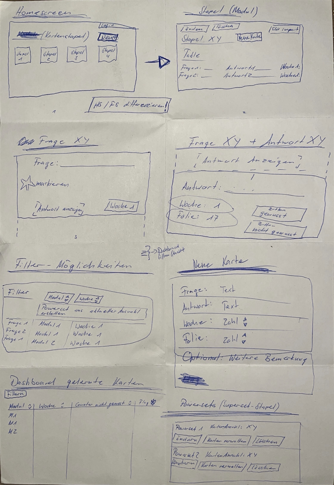
  *Handschriftliche Skizzen der Varianten aus der Sketch-Phase (Woche 9): Homescreen, Stapel-Detail, Filter-Ansicht, Neue-Karte-Formular, Powersets, Lernmodus.*

  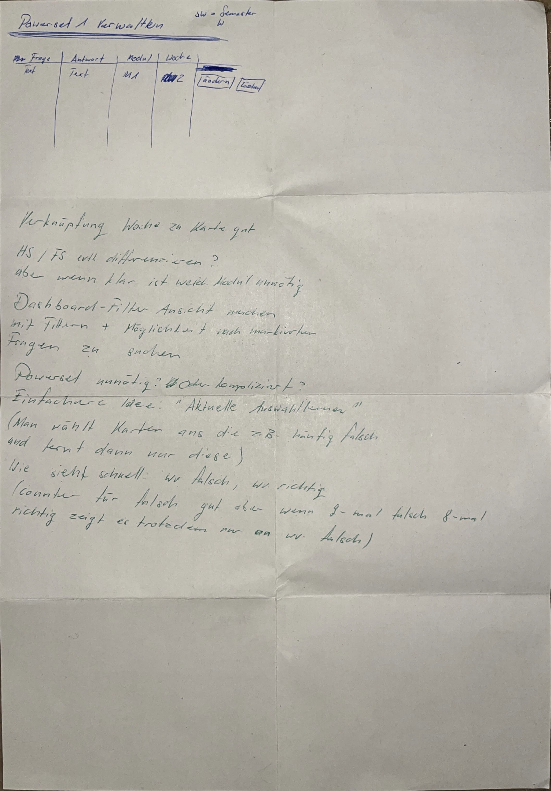
  *Feedback-Notizen auf den Skizzen: «Verknüpfung Woche zu Karte gut», «Powerset unnötig?», «Dashboard-Filter Ansicht machen» usw.*

---

### 3.3 Decide

#### Gewählte Variante & Begründung

Die einfache Dashboard-Filter-Variante mit direktem Vorlesungsbezug wurde gewählt. Die Entscheidung basiert auf einer Kombination aus Nutzerfeedback, Machbarkeitsüberlegungen und strategischer Fokussierung auf die Kernlücke.

**Entscheidungskriterien:**
- Feedback aus der Sketch-Phase: «Powerset unnötig?», «Dashboard-Filter Ansicht machen», «Einfachere Idee: Aktuelle Auswahl lernen» — das Feedback hat klar aufgezeigt, dass Komplexität die Usability reduziert, ohne das Kernproblem besser zu lösen
- Realistisch umsetzbar im Rahmen der Lehrveranstaltung. Der Verzicht auf Powersets hebt das Kernfeature (Den Vorlesungsbezug) hervor, so dass dieses qualitativ hochwertig umgesetzt werden kann.
- Fokus auf die identifizierte Lücke (Vorlesungsbezug) ohne Überfrachtung. D.h. weniger Features, aber dafür jedes davon konsequent umgesetzt
- Bestätigtes positives Feedback zum zentralen Differenzierungsmerkmal von Mitstudierenden: «Verknüpfung Woche zu Karte gut»

#### End-to-End-Ablauf

**Workflow A – Karte erstellen und bearbeiten:**
1. User meldet sich an und befindet sich auf der Stapelübersicht
2. Klick auf «Öffnen» bei einem Modul (z.B. Strategisches Management)
3. Detailansicht mit Kartenliste öffnet sich
4. Klick auf «+ Neue Karte»
5. Formular ausfüllen (Frage, Antwort, Woche, Folien-Nr.)
6. Klick auf «Karte erstellen»
7. Bestätigungsansicht mit Kartenvorschau erscheint
8. Optional: «Bearbeiten» (Formular erneut öffnen) oder «Weitere Karte hinzufügen»

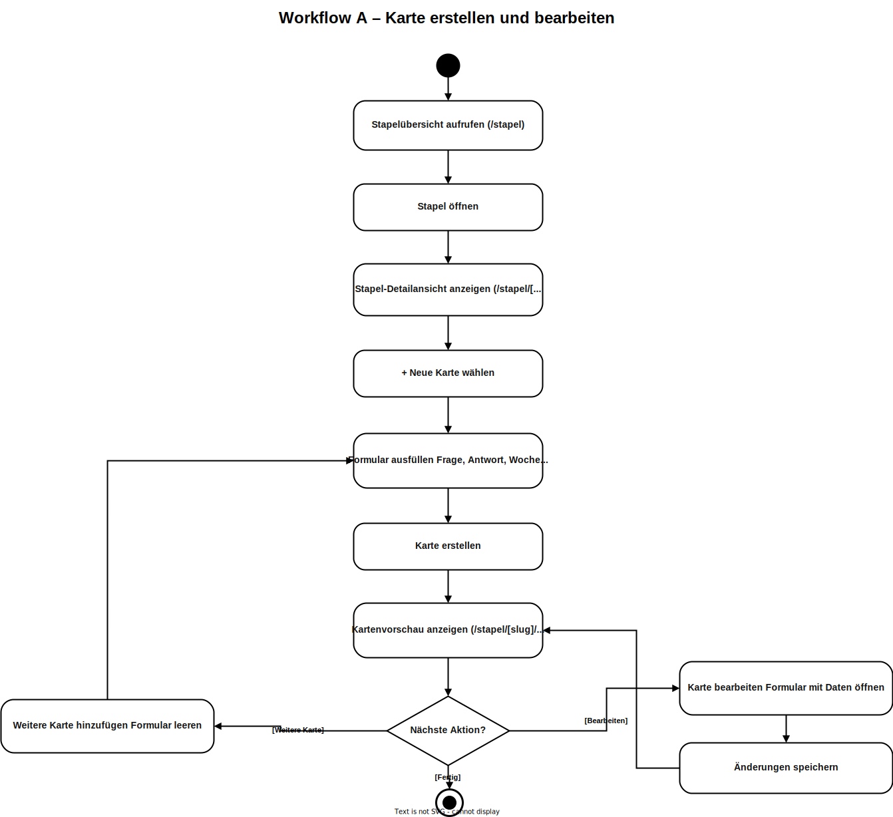


**Workflow B – Lernmodus:**
1. Aus Stapel-Detailansicht: Klick auf «JETZT LERNEN»
2. Lernmodus öffnet sich; Vorderseite (Frage) und Metadaten (Woche, Folie) werden angezeigt
3. User überlegt Antwort → Klick auf «Antwort anzeigen»
4. Rückseite (Antwort) wird eingeblendet
5. User evaluiert Wissen: Klick auf «Gewusst» (grün) oder «Repetieren» (rot)
6. Nächste Karte wird geladen (Loop bis Stapel durchgearbeitet)

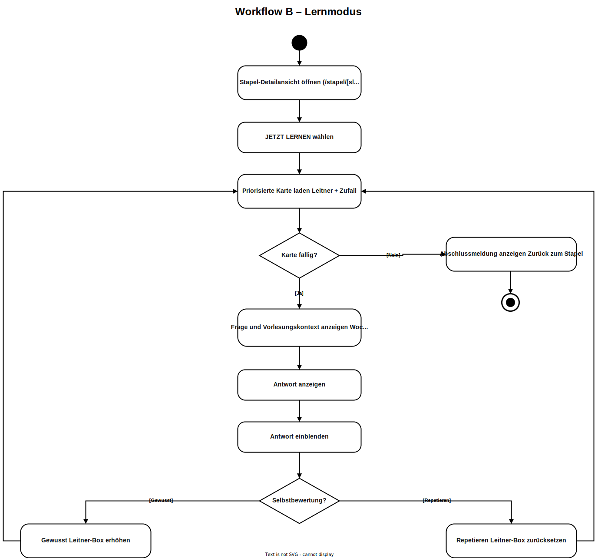

#### User Journey Map

Die User Journey Maps zeigen für beide Haupt-Workflows je Phase, was der User tut, denkt und fühlt — sowie wo Pain Points bestehen und wie der Prototyp diese adressiert.

**Workflow A – Karte erstellen**

| | Einstieg | Stapel öffnen | Formular ausfüllen | Karte speichern | Bestätigung |
|---|---|---|---|---|---|
| **Aktion** | Navigiert zu `/stapel` | Klickt «Öffnen» beim Modul | Füllt Frage, Antwort, Woche, Folie aus | Klickt «Karte erstellen» | Prüft Vorschau, wählt nächste Aktion |
| **Gedanken** | «Welcher Stapel ist der richtige?» | «Hier sind meine bisherigen Karten» | «Welche Woche und Folie war das nochmal?» | «Hat das geklappt?» | «Sieht gut aus, noch eine Karte oder bearbeiten?» |
| **Emotion** | Neutral | Orientiert | Konzentriert | Angespannt | Erleichtert / Zufrieden |
| **Pain Point** | Login erforderlich | – | Folie/Woche muss aus Vorlesungsunterlagen nachgeschaut werden | Ohne Rückmeldung kein Wissen ob gespeichert | – |
| **Lösung im Prototyp** | Einfache Registrierung via E-Mail + Passwort (Supabase Auth) | Klar gegliederte Card-Liste mit Modulname | Pflichtfelder Woche + Folie erzwingen den Vorlesungsbezug | Sofortige Weiterleitung auf Bestätigungsseite | Kartenvorschau als visuelles Feedback inkl. hochgeladenem Bild |

---

**Workflow B – Lernmodus**

| | Lernmodus starten | Frage lesen | Antwort aufdecken | Selbstbewertung | Loop / Abschluss |
|---|---|---|---|---|---|
| **Aktion** | Klickt «JETZT LERNEN» im Stapel | Liest Frage, überlegt Antwort | Klickt «Antwort anzeigen» | Klickt «Gewusst» (grün) oder «Repetieren» (rot) | Nächste Karte erscheint; am Ende → zurück zum Stapel |
| **Gedanken** | «Welche Karten kommen zuerst?» | «Wie war das nochmal?» | «War meine Antwort richtig?» | «War ich wirklich sicher genug für ‹Gewusst›?» | «Wann muss ich diese Karte wiederholen?» |
| **Emotion** | Motiviert | Konzentriert / leicht unsicher | Neugierig | Reflektierend | Befriedigt / Erschöpft |
| **Pain Point** | Unklare Reihenfolge ohne Priorisierung | Kein Kontext, in welcher Vorlesung das Thema war | – | Selbsteinschätzung ohne Bewertungsmassstab schwierig | Ungewiss, wann die Karte wieder erscheint |
| **Lösung im Prototyp** | Leitner-Box priorisiert fällige Karten automatisch | Woche + Folie direkt auf der Vorderseite sichtbar | Klarer Trenner zwischen Frage und Antwort | Farbcodierung grün/rot als etablierter Standard | Leitner-Intervalle berechnen nächstes Review-Datum |

---

#### Mockup

Das Mockup wurde in Figma erstellt, um die zentralen Screens und den Navigationsfluss vor der Implementierung zu definieren. Es diente als Idee und Referenz für Layout, Farbgebung und Interaktionsdesign während der Umsetzung.

**[Link: Figma Mockup (Karteikarten-prototyping)](https://www.figma.com/design/8ymntmvM2jhG9jjeIZGU9G/Karteikarten-prototyping-Uebung--Kopie-?node-id=0-1&t=GtREeDtehk9bC7LL-1)** 

*Figma-Mockup: Übersicht über die zentralen Screens (Stapelübersicht, Lernmodus, Karte erstellen).*

---

### 3.4 Prototype

#### 3.4.1. Entwurf (Design)

> **Hinweis:** Hier wird der **Prototyp** beschrieben, nicht das **Mockup**.

##### Informationsarchitektur

Die Informationsarchitektur wurde bewusst flach gehalten. So wenige Klicks wie möglich von jedem Einstiegspunkt zur gewünschten Aktion. Lernende wollen Karten erstellen oder lernen, nicht durch Sub-Menüs navigieren. Tiefe Hierarchien hätten dieses Ziel untergraben und die Usability erschwert.

- Home (`/`) → Login (`/login`) oder Registrieren (`/registrieren`) → Stapelübersicht (`/stapel`)
- Stapelübersicht (`/stapel`) → Stapel-Detail (`/stapel/[slug]`) → Lernmodus oder Karte erstellen/bearbeiten
- Dashboard (`/dashboard`) → Stapel-Detail (alternativer Einstieg über Statistiken)
- Alle destruktiven Aktionen (Löschen) auf separate Bestätigungsseiten ausgelagert — verhindert versehentliches Löschen
- Geschützte Routen (`/stapel`, `/dashboard`) leiten ohne Session automatisch zu `/login` weiter (`hooks.server.js`)

##### User Interface Design

Die folgenden Screenshots zeigen die implementierten Hauptansichten des Prototyps.

**Login (`/login`)**

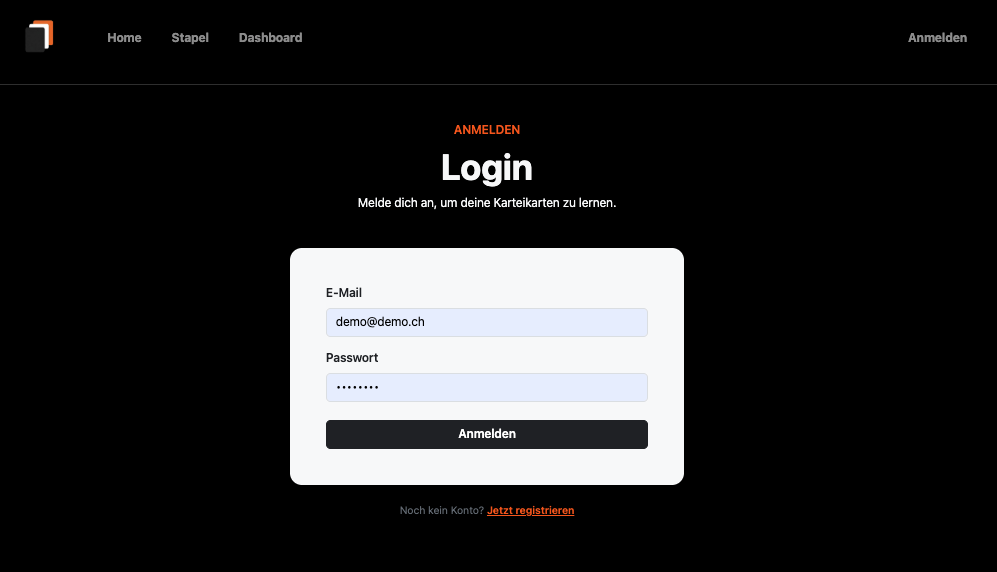
*Anmeldeseite mit E-Mail- und Passwortfeld. Der Einstieg bleibt bewusst schlicht, damit der Fokus schnell auf den eigentlichen Lernbereich wechselt.*

**Registrierung (`/registrieren`)**

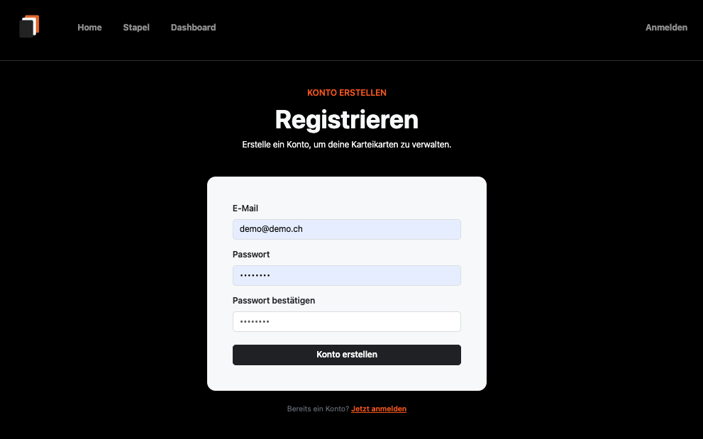
*Registrierungsseite für neue Accounts. Die Oberfläche folgt dem gleichen Formularmuster wie der Login und bleibt dadurch konsistent.*

**Stapelübersicht (`/stapel`)**

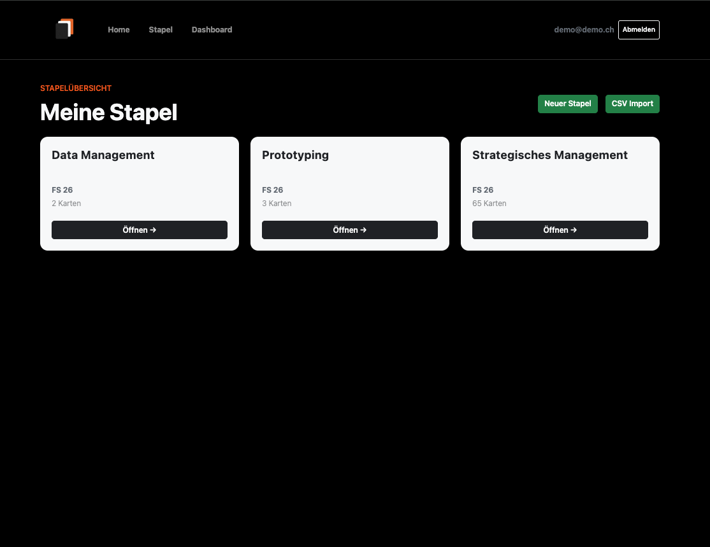
*Übersicht aller Lernstapel als Card-Raster. Jede Karte zeigt Modulname, Semester und Kartenanzahl. Die Primäraktion «Öffnen» ist prominent platziert.*

**Stapel-Detail mit Kartenliste und Filtern (`/stapel/[slug]`)**

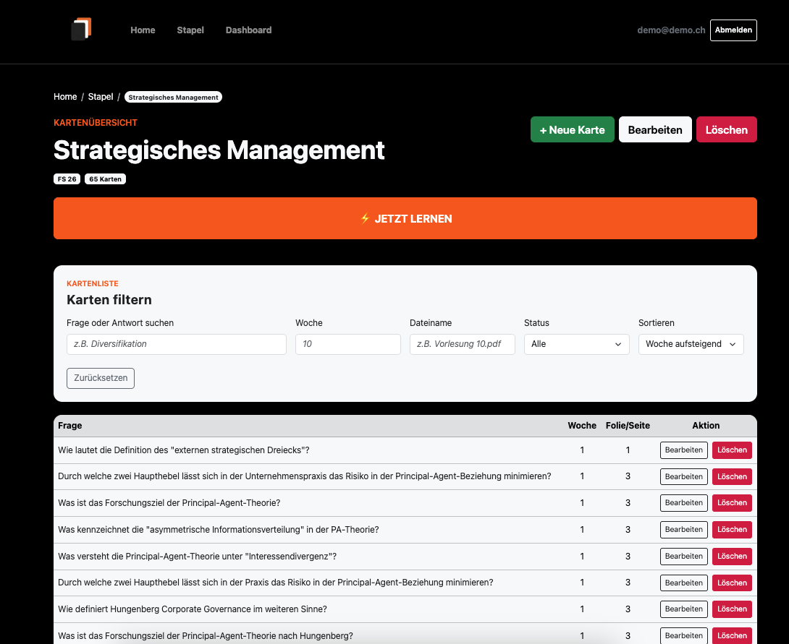
*Detailansicht eines Stapels nach der Anpassung: Kartenliste mit Filtern (Woche, Quelle, Suchfeld). Hauptaktionen «JETZT LERNEN» und «+ Neue Karte» sind im oberen Bereich sichtbar.*

**Stapel-Detail: Stand während Usability-Test**


*Stand während des Usability-Tests: Die Stapel-Detailseite diente als Grundlage für Feedback zur Orientierung, Sichtbarkeit der Aktionen und Nutzbarkeit der Kartenliste.*

**Lernmodus – Frage (`/stapel/[slug]/lernen`)**

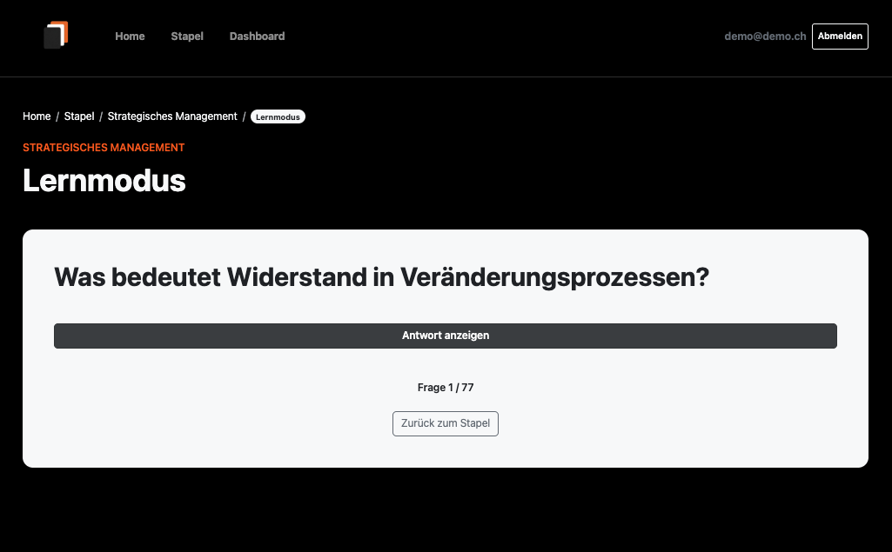
*Lernmodus: Nur die Frage und die Metadaten (Woche, Folie) sind sichtbar. Der User soll die Antwort zunächst selbst formulieren, bevor er sie aufdeckt.*

**Lernmodus – Antwort**

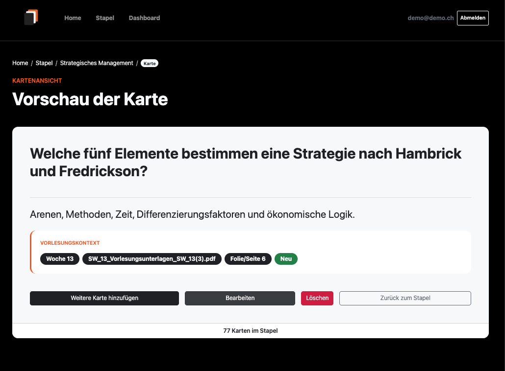
*Nach Klick auf «Antwort anzeigen» erscheint die Rückseite der Karte. Die farbigen Buttons «Gewusst» (grün) und «Repetieren» (rot) ermöglichen die Selbstbewertung.*

**Karte erstellen (`/stapel/[slug]/karten/neu`)**

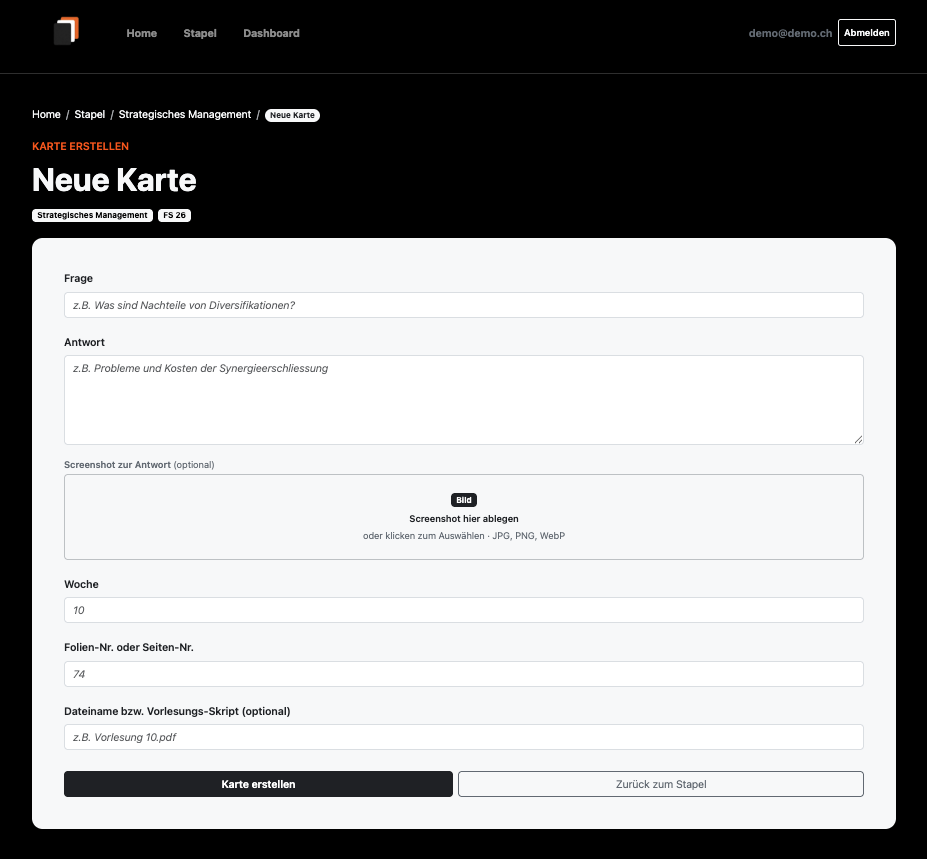
*Formular mit 4 Pflichtfeldern: Frage, Antwort, Woche (Zahl) und Folie (Zahl). Das Formular ist bewusst schlank — nur das Notwendige, kein optionaler Overhead.*

**Kartenvorschau nach Erstellung (`/stapel/[slug]/karten/[id]`)**

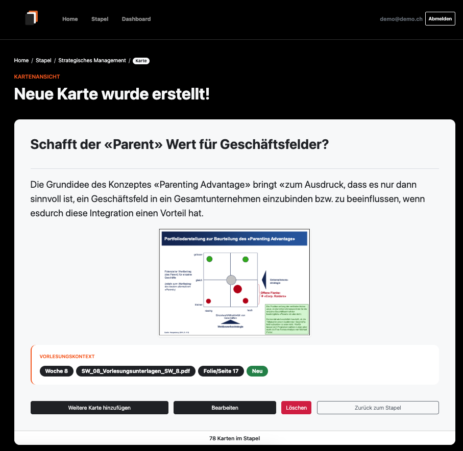
*Bestätigungsansicht nach dem Erstellen einer Karte: sofortiges visuelles Feedback mit der Kartenvorschau. Optionen: «Bearbeiten» oder «Weitere Karte hinzufügen».*

##### Designentscheidungen

Die Designentscheide orientieren sich an den Prinzipien der Benutzerfreundlichkeit (Usability) und der Zweckmässigkeit für eine Lernanwendung.

Die Farbpalette wurde mit dem Figma [color palette generator](https://www.figma.com/color-palette-generator/?colors=000000-F2F2F2-FF670F-D90000-239C1A) festgelegt und im lokalen [Styleguide](doc/STYLEGUIDE.md) dokumentiert. Sie kombiniert Schwarz für den App-Hintergrund, Hellgrau für Inhaltsflächen, Orange als Akzentfarbe sowie Rot und Grün für Lern- und Statusfeedback.

| Entscheid | Umsetzung | Begründung (Warum) |
|---|---|---|
| **Desktop-First** | Querformat, optimiert für Laptop/PC | Studierende lernen typischerweise am Schreibtisch; Desktop ermöglicht paralleles Öffnen von Vorlesungsfolien und der App nebeneinander. |
| **Dark Theme** | Dunkler Hintergrund, weisse Content-Cards | Hoher Kontrast fokussiert den Blick auf den Lerninhalt; schont die Augen bei längeren Lernsessions am Abend. |
| **Card-Design** | Module als einzelne Cards auf der Übersicht | Kartenbasiertes Layout ist intuitiv greifbar und räumt die Oberfläche auf. Jedes Modul ist ein klar abgegrenzter Lernblock. |
| **Klare visuelle Hierarchie** | Orange für zentrale Lern-CTAs, helle Cards für Inhalte und Bootstrap-Statusfarben für Erfolg/Gefahr | Nach dem Redesign trennt diese Logik Orientierung, Inhalt und Status semantisch klarer und macht die Bedienung konsistenter. |
| **Farbcodierung Lernmodus** | Grün = «Gewusst», Rot = «Repetieren» | Etablierte Farbcodes (grün = Erfolg, rot = Fehler) minimieren den  Aufwand bei der Selbstbewertung, somit ist wenig bis keine Erklärung nötig. |
| **Akzentfarbe Orange (#FF670F)** | `--color-accent` in `src/style.css`; Utility-Klassen `.text-accent`, `.btn-accent`, `.text-bg-accent`. Rot/Grün über Bootstrap `danger`/`success`; Body-Hintergrund und Textfarbe via `body {}` in `style.css`. | Einzige projektspezifische Ergänzung zu Bootstrap — hebt Hero-Titel, Abschnittsüberschriften und primäre Buttons hervor, ohne das Dark Theme zu überladen. |
| **Feedback-Schleifen** | Vorschau nach Kartenerstellung | Verhindert das blinde Weiterarbeiten mit fehlerhaften Karten; sofortiges Feedback erlaubt schnelle Korrektur ohne Unterbrechung des Workflows. |

---

#### 3.4.2. Umsetzung (Technik)

##### Technologie-Stack

| Bereich | Verwendet |
|---|---|
| **Frontend / Framework** | SvelteKit, Svelte, Vite |
| **UI / Styling** | Bootstrap per CDN, ergänzende eigene CSS-Regeln |
| **Datenbank** | MongoDB mit Node.js Treiber |
| **Authentifizierung** | Supabase Auth |
| **Bildspeicherung** | Supabase Storage |
| **Deployment** | Netlify mit SvelteKit Netlify Adapter |

##### Tooling

VS Code als Entwicklungsumgebung; KI-Einsatz (Claude Code, ChatGPT, Codex) für Implementierung. Details zum KI-Einsatz folgen in Kapitel 6.

##### Struktur & Komponenten

Die SvelteKit-Konvention (file-based Routing) wurde konsequent angewendet: Jede Route ist ein eigener Ordner mit `+page.svelte` (UI) und `+page.server.js` (Datenzugriff). Diese klare Trennung macht den Code nachvollziehbar und verhindert, dass Datenbanklogik in UI-Komponenten eingebettet wird.

Seitenstruktur (Routen):

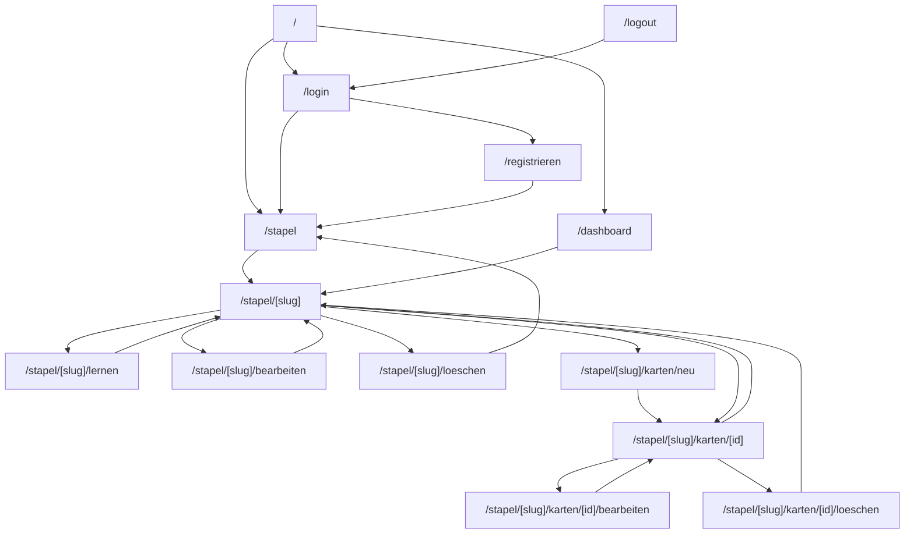
```mermaid
flowchart TD
    Home --> Login
    Home --> Stapel
    Home --> Dashboard
    Login --> Registrieren
    Login --> Stapel
    Registrieren --> Stapel
    Logout --> Login

    Stapel --> StapelDetail
    Dashboard --> StapelDetail

    StapelDetail --> Lernen
    Lernen --> StapelDetail
    StapelDetail --> StapelBearbeiten
    StapelBearbeiten --> StapelDetail
    StapelDetail --> StapelLoeschen
    StapelLoeschen --> Stapel

    StapelDetail --> NeueKarte
    NeueKarte --> Kartenvorschau
    StapelDetail --> Kartenvorschau
    Kartenvorschau --> KarteBearbeiten
    KarteBearbeiten --> Kartenvorschau
    Kartenvorschau --> KarteLoeschen
    KarteLoeschen --> StapelDetail
    Kartenvorschau --> StapelDetail

    Home["/"]
    Login["/login"]
    Registrieren["/registrieren"]
    Logout["/logout"]
    Stapel["/stapel"]
    Dashboard["/dashboard"]
    StapelDetail["/stapel/[slug]"]
    Lernen["/stapel/[slug]/lernen"]
    StapelBearbeiten["/stapel/[slug]/bearbeiten"]
    StapelLoeschen["/stapel/[slug]/loeschen"]
    NeueKarte["/stapel/[slug]/karten/neu"]
    Kartenvorschau["/stapel/[slug]/karten/[id]"]
    KarteBearbeiten["/stapel/[slug]/karten/[id]/bearbeiten"]
    KarteLoeschen["/stapel/[slug]/karten/[id]/loeschen"]
```

Routenübersicht:

| Route | Zweck | Einstieg |
|---|---|---|
| `/` | Home-Seite mit App-Einstieg | Navbar `Home` |
| `/login` | Anmeldeformular (E-Mail + Passwort) | Redirect bei fehlender Session, Link in Navbar |
| `/registrieren` | Registrierungsformular für neue Accounts | Link auf Login-Seite |
| `/logout` | Session beenden und zu `/login` weiterleiten | Abmelden-Button in Navbar |
| `/stapel` | Übersicht aller eigenen Lernstapel | Navbar `Stapel` |
| `/dashboard` | Dashboard mit Kennzahlen und Stapelstatistiken | Navbar `Dashboard` |
| `/stapel/[slug]` | Detailseite eines Stapels mit Kartenliste und Filtern | Stapelkarte, Dashboard-Tabelle |
| `/stapel/[slug]/lernen` | Lernmodus mit Frageansicht, Antwortanzeige und Bewertung | Button `JETZT LERNEN` |
| `/stapel/[slug]/karten/neu` | Formular zum Erstellen einer neuen Karte | Button `+ Neue Karte` |
| `/stapel/[slug]/karten/[id]` | Vorschau einer einzelnen Karte inkl. Bild | Kartenliste, Weiterleitung nach Erstellung |
| `/stapel/[slug]/karten/[id]/bearbeiten` | Formular zum Bearbeiten einer Karte | Aktion `Bearbeiten` |
| `/stapel/[slug]/karten/[id]/loeschen` | Bestätigung zum Löschen einer Karte | Aktion `Löschen` |
| `/stapel/[slug]/bearbeiten` | Formular zum Bearbeiten eines Stapels | Aktion `Bearbeiten` im Stapel |
| `/stapel/[slug]/loeschen` | Bestätigung zum Löschen eines Stapels | Aktion `Löschen` im Stapel |

Komponenten (Begründung warum als Komponenten ausgelagert):

| Komponente | Datei | Warum ausgelagert |
|---|---|---|
| `FlashcardForm` | `src/lib/components/FlashcardForm.svelte` | Wird sowohl beim Erstellen als auch beim Bearbeiten verwendet — Wiederverwendung statt Codeduplizierung |
| `DeckCard` | `src/lib/components/DeckCard.svelte` | Einheitliche Darstellung aller Stapel auf der Übersicht; Änderungen am Layout müssen nur an einem Ort vorgenommen werden |
| `Breadcrumbs` | `src/lib/components/Breadcrumbs.svelte` | Navigationspfad auf allen Unterseiten konsistent; aktive Seite wird hervorgehoben |

##### Daten & Schnittstellen

Aktueller Stand: Die App verwendet die MongoDB-Datenbank `Karteikarten` und darin die Collection `Karteikarten`. In dieser Collection werden zwei Dokument-Typen gespeichert. Das hält den Prototyp schlank, weil Stapel und Karten im selben Lernkontext verarbeitet werden:

- **Deck:** `{ type: "deck", deckSlug, deckTitle, semester, userId (opt.), createdAt, updatedAt }`
- **Card:** `{ type: "card", question, answer, deckSlug, deckTitle, semester, week, slide, sourceName (opt.), status, leitnerBox, repeatCount, knownCount, lastReviewedAt, nextReviewAt, imageUrl (opt.), imagePosition (opt.), userId (opt.), createdAt, updatedAt }`

Wichtige Feldbedeutungen:

- `deckSlug` verbindet Karten mit dem Stapel und wird auch für lesbare URLs verwendet.
- `week`, `slide` und `sourceName` speichern den Vorlesungskontext der Karte.
- `status` verwendet `new`, `known` oder `repeat`.
- `leitnerBox`, `repeatCount`, `knownCount`, `lastReviewedAt` und `nextReviewAt` bilden den Lernfortschritt ab.
- `imageUrl` und `imagePosition` speichern optionale Kartenbilder aus Supabase Storage.
- `userId` ist optional, damit ältere Seed-/Altdaten ohne User-Zuordnung weiterhin sichtbar bleiben.

Datenzugriff zentral in `src/lib/db.js` — alle MongoDB-Operationen liegen an einem Ort, damit Routen-Dateien sauber bleiben und die Datenlogik unabhängig von der UI gepflegt werden kann:

| Funktion | Typ | Beschreibung |
|---|---|---|
| `getDecks(userId = null)` | Lesen | Stapel mit Kartenanzahl, gefiltert nach User und rückwärtskompatibel mit Altdaten ohne `userId` |
| `getDeckBySlug(deckSlug, userId = null)` | Lesen | Einzelner Stapel nach URL-Slug |
| `getCardsByDeckSlug(deckSlug, filters, userId = null)` | Lesen | Kartenliste mit Filtern nach Suchbegriff, Woche, Quelle, Status und Sortierung |
| `getSourceNamesByDeckSlug(deckSlug)` | Lesen | Alle verwendeten Quellnamen eines Stapels für Vorschläge im Formular |
| `getLearningQueueByDeckSlug(deckSlug)` | Lesen | Fällige Lernkarten als Leitner-gewichtete Warteschlange |
| `getAllCardsQueueByDeckSlug(deckSlug)` | Lesen | Alle Karten eines Stapels als Leitner-gewichtete Warteschlange |
| `getDashboardStats(userId = null)` | Lesen | Aggregierte Lernstatistiken, fällige Karten und Wiederholungslisten per MongoDB-Pipeline |
| `getCard(id)` | Lesen | Einzelne Karte nach MongoDB-ObjectId |
| `createDeck(deck)` / `createCard(card)` | Erstellen | Neuer Stapel bzw. neue Karte; `userId` wird aus der Session ergänzt, wenn vorhanden |
| `updateDeck(oldDeckSlug, deck)` / `updateCard(card)` | Bearbeiten | Stapel inklusive zugehöriger Karten bzw. einzelne Karte aktualisieren |
| `updateCardStatus(id, status)` | Bearbeiten | Speichert `known` oder `repeat` und berechnet daraus Leitner-Box, Zähler und nächstes Review-Datum |
| `deleteDeck(deckSlug)` / `deleteCard(id)` | Löschen | Stapel inkl. aller zugehörigen Karten bzw. einzelne Karte löschen |

Weitere serverseitige Schnittstellen:

- Supabase Auth wird in `src/hooks.server.js`, `src/lib/supabase.js`, `/login`, `/registrieren` und `/logout` verwendet.
- Supabase Storage wird über `uploadCardImage()` und `deleteCardImage()` in `src/lib/supabase.js` für optionale Kartenbilder angebunden.
- CSV-Import läuft serverseitig in `/stapel` über `previewCsv` und `importCsv`; importierte Karten werden danach über `createDeck()` und `createCard()` in MongoDB gespeichert.

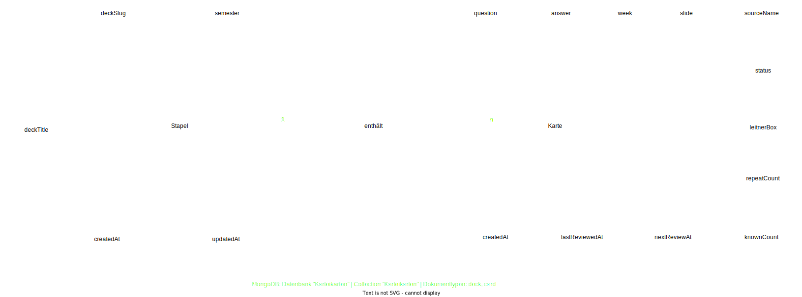
*ER-Modell: Stapel und Karte in Chen Notation mit MongoDB-Dokumenttypen.*


*Systemarchitektur: Browser, SvelteKit-Routen, serverseitige Actions, zentrale Datenbankschicht, MongoDB-Anbindung sowie Supabase Auth und Supabase Storage.*

##### Deployment

Netlify via `@sveltejs/adapter-netlify`; URL: https://pt-karteikarten.netlify.app/

##### Besondere Entscheidungen

| Entscheid | Warum |
|---|---|
| Kein Powerset-Feature | Komplexität unverhältnismässig zum Nutzen; hätte die Entwicklung des Kernfeatures (Vorlesungsbezug) gefährdet |
| Minimales Formular (4 Pflichtfelder) | Jedes zusätzliche Pflichtfeld erhöht die Hürde zum Erstellen einer Karte; die 4 gewählten Felder decken den Minimalfall vollständig ab |
| Server-seitige DB-Verbindung | MongoDB-Credentials werden nie an den Browser übermittelt; `+page.server.js` sorgt dafür, dass die Verbindung ausschliesslich server-seitig stattfindet |
| Slug statt ID in URLs | Lesbare URLs (z.B. `/stapel/statistik`) verbessern die Orientierung und Teilbarkeit — kein kryptischer UUID in der Adressleiste |
| Supabase Auth statt eigener Implementation | Vollständig managed; keine eigene Auth-Infrastruktur; Cookie-basierte Sessions via `@supabase/ssr` integrieren nahtlos in SvelteKit-Hooks |
| Supabase Storage für Bilder | Server-seitiger Upload via Service-Role-Key verhindert direkten Browser-Zugriff auf Storage-Credentials; öffentlicher Bucket ermöglicht direkte Bild-URLs ohne Proxy |
| userId rückwärtskompatibel | `$or: [{ userId }, { userId: { $exists: false } }]` — Altdaten ohne userId bleiben für alle eingeloggten User sichtbar; kein Datenverlust beim Rollout |

---

### 3.5 Validate

- **URL der getesteten Version:** https://pt-karteikarten.netlify.app/
- **Ziele der Prüfung:** Geprüft wurde, ob die Woche-Folie-Verknüpfung für Nutzer:innen intuitiv erkennbar ist, ob eine neue Karte ohne zusätzliche Erklärung erstellt werden kann und ob CSV-Import sowie Stapel-Detailseite verständlich genug sind.
- **Vorgehen:** Usability-Test mit typischen Aufgaben entlang der Kernflows: anmelden, Stapel öffnen, Kartenliste prüfen, Karte erstellen, CSV-Import finden und Lernmodus starten.
- **Stichprobe:** Usability-Test mit Testpersonen aus dem studentischen Nutzungskontext.
- **Aufgaben/Szenarien:** Karte in einem bestehenden Stapel finden, neue Karte mit Vorlesungskontext erstellen, CSV-Import als Funktion erkennen und den Lernmodus über die Stapel-Detailseite starten.
- **Kennzahlen & Beobachtungen:** Qualitative Beobachtungen standen im Vordergrund: Orientierung auf der Stapel-Detailseite, Sichtbarkeit der Hauptaktionen und Verständlichkeit des CSV-Imports.
- **Dokumentation / Auswertung:** Die Testnotizen und Auswertung wurden in [Usability-Test-PT-Karteikarten.xlsx](Usability-Test-PT-Karteikarten.xlsx) festgehalten.
- **Abgeleitete GitHub Issues:**
  - [#19 Dashboard für Lernfortschritt besser auffindbar machen](https://github.com/russoren1/PT-Karteikarten/issues/19)
  - [#20 Beim CSV-Import bestehenden Stapel auswählen oder neuen Stapel erstellen können](https://github.com/russoren1/PT-Karteikarten/issues/20)

**Issue Map aus dem Usability-Test**

Für die prototyprelevante Issue Map wurden bewusst nur Probleme aufgenommen, die zentrale Nutzerziele betreffen. Weitere Beobachtungen wie Animationen, Erinnerungen, Historie oder zusätzliche Lernmodi wurden als spätere Komfortfunktionen eingeordnet.

| Arbeitsschritt / Szenario | Fragestellung | Testperson 1 | Testperson 2 | Konsolidiertes Issue |
|---|---|---|---|---|
| Lernfortschritt / Nachholbedarf finden | Finden Nutzende intuitiv, wo sie Lernfortschritt und offene Wiederholungen sehen können? | Unsicherheit beim Finden des Dashboards bzw. Lernfortschritts | Dashboard musste ebenfalls gesucht werden; Einstieg war nicht sofort klar | [#19 Dashboard / Lernfortschritt ist nicht intuitiv auffindbar](https://github.com/russoren1/PT-Karteikarten/issues/19) |
| Karteikarten per CSV importieren | Verstehen Nutzende, wie importierte Karteikarten einem bestehenden Stapel zugeordnet werden? | Import grundsätzlich verständlich, aber Stapel-Zuordnung nicht klar genug | Unsicherheit, wo die importierten Karten abgelegt werden | [#20 CSV-Import braucht klare Stapel-Zuordnung](https://github.com/russoren1/PT-Karteikarten/issues/20) |

**Issue Map Karte 1: Dashboard / Lernfortschritt**

| Attribut | Beschreibung |
|---|---|
| Arbeitsschritt | Lernfortschritt / Nachholbedarf anzeigen |
| Ort im Prototyp | Navigation / Einstieg zum Dashboard |
| Beobachtung | Die Testpersonen konnten das Dashboard bzw. den Lernfortschritt nicht sofort intuitiv finden. |
| Problem | Die Funktion ist vorhanden und wurde nach dem Öffnen als hilfreich verstanden, ist aber im Interface nicht sichtbar genug platziert. |
| Ursache | Der Einstieg zum Dashboard ist zu wenig prominent oder der Begriff ist für Nutzende nicht eindeutig genug. |
| Auswirkung | Nutzende könnten eine zentrale Funktion des Prototyps übersehen; dadurch wird der Mehrwert der App geschwächt. |
| Empfehlung | Dashboard bzw. Lernfortschritt klarer in der Navigation platzieren und ggf. mit verständlicherem Label wie `Lernfortschritt` benennen. |
| Schweregrad | 3 – Grosses Usability-Problem |
| Priorität | Hoch |
| Entscheidung | Für den Prototyp relevant und umzusetzen. |
| GitHub Issue | [#19 Dashboard für Lernfortschritt besser auffindbar machen](https://github.com/russoren1/PT-Karteikarten/issues/19) |

**Issue Map Karte 2: CSV-Import / Stapel-Zuordnung**

| Attribut | Beschreibung |
|---|---|
| Arbeitsschritt | Karteikarten per CSV importieren |
| Ort im Prototyp | CSV-Import-Workflow |
| Beobachtung | Der CSV-Import wurde grundsätzlich positiv bewertet, aber die Zuordnung zu einem bestehenden Stapel war nicht eindeutig. |
| Problem | Nutzende wissen nicht sicher, in welchem Stapel die importierten Karteikarten landen. |
| Ursache | Im Importprozess fehlt eine explizite Auswahl oder Bestätigung des Zielstapels. |
| Auswirkung | Nutzende können verunsichert sein, ob der Import korrekt funktioniert hat; im schlimmsten Fall werden Karten falsch abgelegt oder müssen gesucht werden. |
| Empfehlung | Beim CSV-Import soll der Zielstapel explizit ausgewählt oder ein neuer Stapel erstellt werden können. Vor dem Import soll eine kurze Zusammenfassung angezeigt werden. |
| Schweregrad | 3 – Grosses Usability-Problem |
| Priorität | Hoch |
| Entscheidung | Für den Prototyp relevant und umzusetzen. |
| GitHub Issue | [#20 Beim CSV-Import bestehenden Stapel auswählen oder neuen Stapel erstellen können](https://github.com/russoren1/PT-Karteikarten/issues/20) |

**Stapel-Detail: Vorher/Nachher nach Usability-Test**


*Vorher: Stand der Stapel-Detailseite während des Usability-Tests.*


*Nachher: Überarbeiteter Stand der Stapel-Detailseite nach der Anpassung. Die Gegenüberstellung macht sichtbar, wie die Orientierung und die wichtigsten Aktionen nach dem Test geschärft wurden.*

**CSV-Import: Stand während Usability-Test**

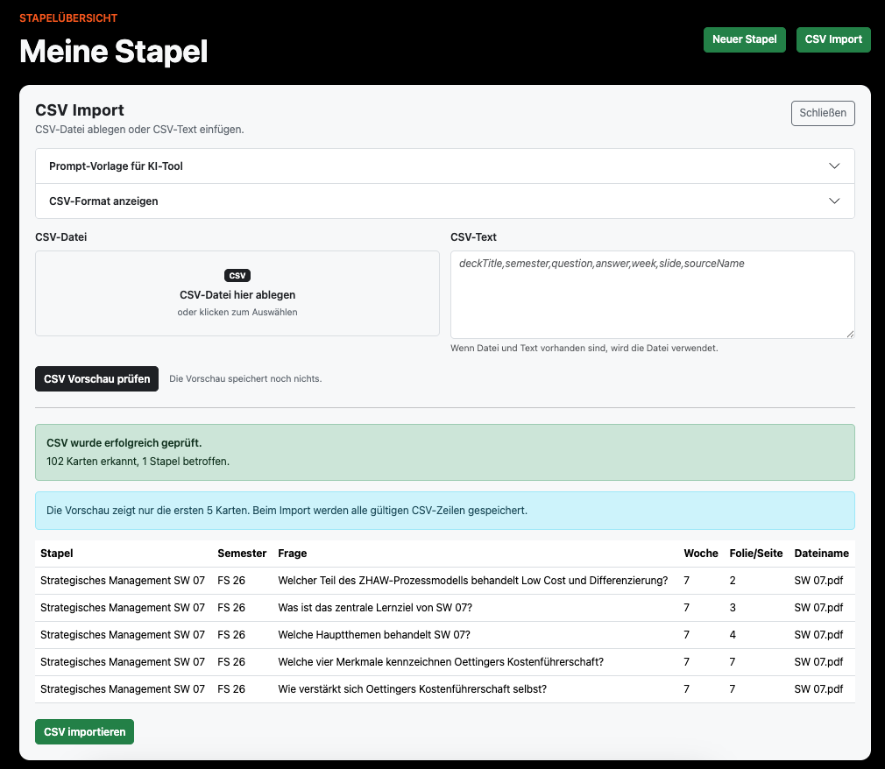
*Vorher: Stand des CSV-Imports während des Usability-Tests. Dieser Screenshot dient als Ausgangspunkt für die spätere Gegenüberstellung nach der Anpassung.*

**CSV-Import: Nach Anpassung**

_[Nach der geplanten Anpassung wird hier der neue Screenshot ergänzt, damit der Vorher/Nachher-Vergleich vollständig sichtbar ist.]_

- **Zusammenfassung der Resultate:** Die Tests zeigten insbesondere Optimierungspotenzial bei der visuellen Führung in der Stapelansicht und bei der Verständlichkeit des CSV-Imports.
- **Abgeleitete Verbesserungen:** Aus dem Usability-Test wurden zwei priorisierte Verbesserungen abgeleitet und als GitHub Issues dokumentiert: bessere Auffindbarkeit des Lernfortschritts sowie klarere Stapel-Zuordnung beim CSV-Import. Stapelansicht und CSV-Import werden anhand der Testbeobachtungen überarbeitet und anschliessend mit neuen Screenshots im direkten Vorher/Nachher-Vergleich dokumentiert.

---

## 4. Erweiterungen

Folgende Erweiterungen wurden über den im Mockup definierten Mindestumfang hinaus eigenständig konzipiert und umgesetzt. Alle Erweiterungen sind klar vom Kern-Mindestumfang abgegrenzt und beeinträchtigen diesen nicht.

> **Hinweis:** Jede Erweiterung ist separat nach dem folgenden Schema beschrieben.

---

### 4.1 Leitner-Box Spaced Repetition

- **Beschreibung & Nutzen:** Der ursprüngliche Lernmodus des Mockups zeigte Karten in einer fixen Reihenfolge — eine einfache, aber lernpsychologisch suboptimale Lösung. Das Leitner-System adressiert ein bekanntes Problem des Lernens: Karten, die man bereits kennt, werden genauso oft wiederholt wie Karten, die man nicht kennt. Mit dem Leitner-System werden Karten je nach Lernerfolg in 5 Boxen eingeteilt und in unterschiedlichen Intervallen (0 / 1 / 3 / 7 / 14 Tage) wiederholt. Schwierige Karten erscheinen häufiger, bekannte seltener — was die Lerneffizienz deutlich steigert.

- **Warum diese Erweiterung?** Die Kernidee der App ist, Lernenden beim effizienten Lernen zu helfen. Ein rein sequenzieller Lernmodus widerspricht diesem Ziel: Er behandelt alle Karten gleich, unabhängig vom Lernfortschritt. Die Leitner-Box-Idee greift genau dort ein und macht die App zu einem echten Lernwerkzeug statt nur zu einer Karteikarten-Verwaltung. Die Idee entstand durch die Auseinandersetzung mit Anki im Rahmen der Marktrecherche.

- **Wo umgesetzt:**
  - **Frontend:** `src/routes/stapel/[slug]/lernen/+page.svelte`
  - **Backend:** `src/lib/db.js` — `getLearningQueueByDeckSlug()` erstellt eine gewichtete Prioritätswarteschlange (neue Karten und Karten aus Box 1 werden bevorzugt); `updateCardStatus()` setzt die Leitner-Box und berechnet das nächste Review-Datum
  - **Datenbank:** Card-Dokument um Felder `leitnerBox`, `repeatCount`, `knownCount`, `lastReviewedAt`, `nextReviewAt` erweitert

- **Referenz:** Lernmodus-Route (`/stapel/[slug]/lernen`); Datenbankschicht `src/lib/db.js`

  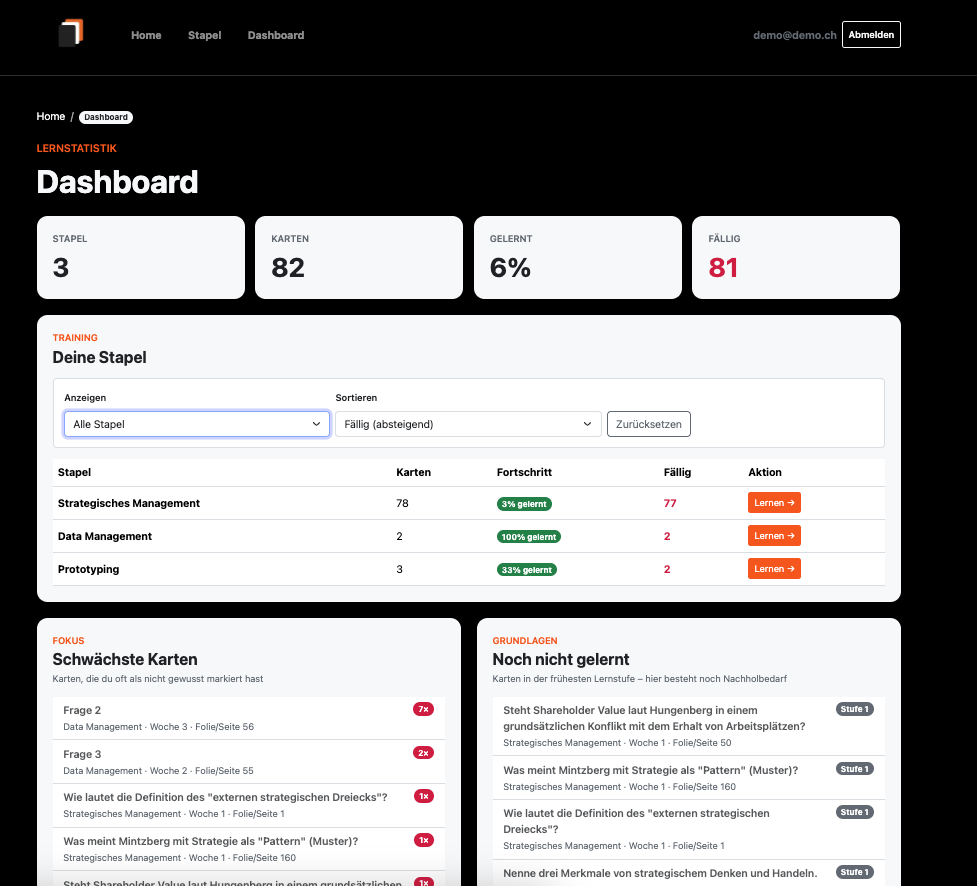
  *Lernmodus mit Leitner-Box-Anzeige: Die aktuelle Box der Karte ist sichtbar. Nach der Bewertung wird die Box entsprechend angepasst.*

- **Aus Evaluation abgeleitet?:** Nein, eigene Erweiterungsidee, inspiriert durch die Marktrecherche zu Anki und Quizlet.

---

### 4.2 Dashboard mit stapelübergreifender Lernstatistik

- **Beschreibung & Nutzen:** Der Mindestumfang sah keine zentrale Statistikansicht vor — Lernende hatten keinen Überblick über ihren Gesamtfortschritt. Das Dashboard zeigt stapelübergreifende Lernkennzahlen: Fälligkeiten pro Stapel, Leitner-Box-Verteilung und gezielten Trainingsbedarf auf einen Blick.

- **Warum diese Erweiterung?** Ohne Dashboard wäre das Leitner-System «blind» — man würde nicht wissen, welche Stapel dringend Wiederholung brauchen. Das Dashboard macht den Lernfortschritt sichtbar und motiviert durch transparente Visualisierung, ähnlich wie Streaks in Sprachlern-Apps. Es setzt den Kontext für die Erweiterung 4.1 und macht die Leitner-Box erst wirklich nützlich.

- **Wo umgesetzt:**
  - **Frontend:** `src/routes/dashboard/+page.svelte`
  - **Backend:** `src/routes/dashboard/+page.server.js` ruft `getDashboardStats()` auf
  - **Datenbank:** `src/lib/db.js` — `getDashboardStats()` aggregiert Daten über alle Stapel (MongoDB-Aggregation-Pipeline)

- **Referenz:** Route `/dashboard`; erreichbar über Navbar-Eintrag «Dashboard»

  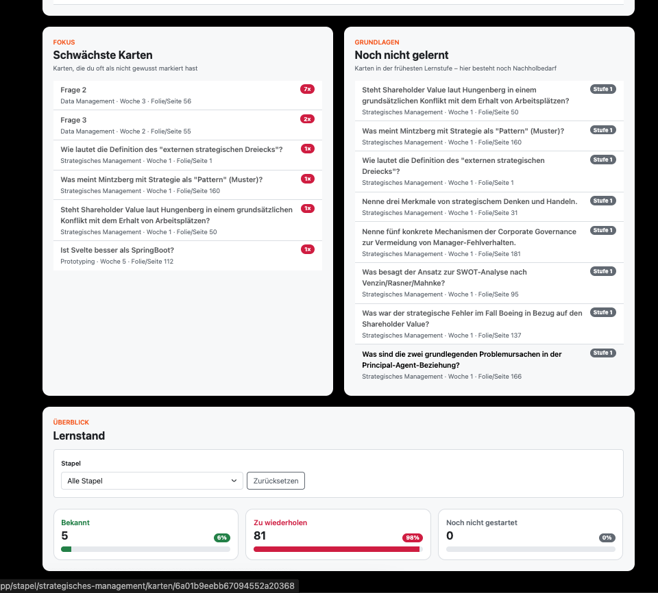
  *Dashboard: Stapelübergreifende Statistiken mit Fälligkeiten, Leitner-Box-Verteilung und Trainingsbedarf pro Stapel.*

- **Aus Evaluation abgeleitet?:** Nein — eigene Erweiterungsidee, als sinnvolle Ergänzung zur Leitner-Box-Erweiterung konzipiert

---

### 4.3 User Management via Supabase Auth

- **Beschreibung & Nutzen:** Jede Studentin und jeder Student kann sich mit E-Mail und Passwort registrieren und anmelden. Alle Stapel und Karteikarten sind dem jeweiligen Account zugeordnet — niemand sieht die Daten anderer Personen.

- **Warum diese Erweiterung?** Der Prototyp war bisher ein Einzelbenutzer-System ohne Datentrennung. Um die App realistisch nutzbar zu machen (z.B. im Kurskontext), ist eine saubere Nutzertrennung notwendig. Supabase Auth wurde gewählt, weil es vollständig managed ist, keine eigene Auth-Infrastruktur braucht und hervorragend mit SvelteKit via `@supabase/ssr` integriert.

- **Wo umgesetzt:**
  - **Route-Guard:** `src/hooks.server.js` — prüft Session bei jedem Request; schützt `/stapel` und `/dashboard`
  - **Login:** `src/routes/login/`
  - **Registrierung:** `src/routes/registrieren/`
  - **Logout:** `src/routes/logout/`
  - **Layout:** `src/routes/+layout.svelte` — Navbar zeigt User-E-Mail und Abmelden-Button
  - **Datenbank:** `src/lib/db.js` — alle Abfragen filtern via `userId`-Feld (rückwärtskompatibel: Altdaten ohne `userId` bleiben sichtbar)

- **Technologie:** Supabase Auth mit `@supabase/ssr`, Cookie-basierte Sessions

---

### 4.4 Bild-Upload pro Karteikarte via Supabase Storage

- **Beschreibung & Nutzen:** Beim Erstellen oder Bearbeiten einer Karte kann optional ein Screenshot hochgeladen werden (JPG, PNG, WebP) — z.B. aus OneNote, Vorlesungsfolien oder einem Skript. Das Bild wird im Lernmodus direkt unterhalb der Frage angezeigt und stellt so den visuellen Vorlesungskontext her.

- **Warum diese Erweiterung?** Die Kernidee der App ist die Verknüpfung von Karteikarten mit ihrer Vorlesungsquelle. Bisher war diese Verknüpfung rein textuell (Woche, Folie, Dateiname). Ein Bild macht diesen Kontext unmittelbar sichtbar: Der Lernende sieht sofort, zu welchem Slide oder welcher Seite die Frage gehört, ohne die Primärquelle öffnen zu müssen.

- **Wo umgesetzt:**
  - **Formular:** `src/lib/components/FlashcardForm.svelte` — Drag & Drop Zone unterhalb des Antwortfeldes; alternativ Klick zum Öffnen des Dateiauswahl-Dialogs; Vorschau mit «Ersetzen»- und «Entfernen»-Button
  - **Neue Karte:** `src/routes/stapel/[slug]/karten/neu/+page.server.js` — Upload via `uploadCardImage()`, öffentliche URL in MongoDB gespeichert
  - **Bearbeiten:** `src/routes/stapel/[slug]/karten/[id]/bearbeiten/+page.server.js` — Bild ersetzen (altes Bild wird zuerst gelöscht) oder entfernen
  - **Löschen:** `src/routes/stapel/[slug]/karten/[id]/loeschen/+page.server.js` — Bild aus Supabase Storage löschen vor DB-Eintrag entfernen
  - **Lernmodus:** `src/routes/stapel/[slug]/lernen/+page.svelte` — Bild unterhalb der Frage angezeigt (vor «Antwort anzeigen»)
  - **Kartenvorschau:** `src/routes/stapel/[slug]/karten/[id]/+page.svelte` — Bild in der Bestätigungsansicht nach Erstellung sichtbar
  - **Kartenliste:** `src/routes/stapel/[slug]/+page.svelte` — Bild-Badge (🖼) in der Tabelle, wenn Karte ein Bild hat
  - **Hilfsfunktionen:** `src/lib/supabase.js` — `uploadCardImage()`, `deleteCardImage()`

- **Datenmodell:** Card-Dokument erhält optionales Feld `imageUrl` (öffentliche URL aus Supabase Storage Bucket `card-images`) und `imagePosition` (fix: `'answer'`)

- **Technologie:** Supabase Storage mit Service-Role-Key für server-seitige Uploads

---

### 4.5 Live-Filter in der Kartenübersicht

- **Beschreibung & Nutzen:** Die Kartenliste eines Stapels kann nach Suchbegriff, Woche, Dateiname/Quelle, Status und Sortierung gefiltert werden. Bei Texteingaben wird automatisch nach kurzer Verzögerung gefiltert; bei Auswahlfeldern wird direkt aktualisiert. Die Nutzer:innen müssen also keinen separaten Button drücken und nicht mit Enter bestätigen.

- **Warum diese Erweiterung?** Gerade bei vielen Karten soll die passende Frage schnell auffindbar sein. Der Live-Filter reduziert Reibung im Arbeitsfluss: Während man einen Suchbegriff oder eine Woche eingibt, wird die Liste automatisch eingegrenzt. Das unterstützt den Kernnutzen der App, weil Karten schneller mit ihrem Vorlesungskontext gefunden werden können.

- **Wo umgesetzt:**
  - **Frontend:** `src/routes/stapel/[slug]/+page.svelte` — Filterformular mit Bootstrap-Formularfeldern; Texteingaben nutzen `oninput` mit 450-ms-Debounce, Selects nutzen `onchange`
  - **Routing:** Filterwerte werden als Query-Parameter in der URL gespeichert, z.B. `?q=...&week=...&sourceName=...&status=...&sort=...`
  - **Backend:** `src/routes/stapel/[slug]/+page.server.js` liest die Query-Parameter und lädt die passende Kartenliste
  - **Datenbank:** `src/lib/db.js` — `getCardsByDeckSlug()` filtert serverseitig nach Suchbegriff, Woche, Quelle und Status

- **Referenz:** Stapel-Detailseite `/stapel/[slug]`, Bereich «Karten filtern»

- **Aus Evaluation abgeleitet?:** Nein, eigene Erweiterung zur besseren Bedienbarkeit und schnelleren Navigation in grossen Stapeln.

---

### 4.6 Breadcrumb-Navigation zur besseren Orientierung

- **Beschreibung & Nutzen:** Auf Unterseiten zeigen Breadcrumbs den aktuellen Navigationspfad, z.B. von `Home` über `Stapel` bis zur aktuell geöffneten Karte oder zum Lernmodus. Die vorherigen Ebenen sind als Links klickbar; die aktuelle Seite wird als Bootstrap-Badge hervorgehoben.

- **Warum diese Erweiterung?** Die App hat mehrere verschachtelte Bereiche wie Stapel-Detailseite, Karte erstellen, Karte bearbeiten, Karte löschen und Lernmodus. Ohne sichtbaren Pfad kann schnell unklar werden, wo man sich gerade befindet. Die Breadcrumbs erleichtern die Orientierung und ermöglichen einen schnellen Rücksprung zum passenden Stapel oder zur Übersicht.

- **Wo umgesetzt:**
  - **Komponente:** `src/lib/components/Breadcrumbs.svelte` — wiederverwendbare Breadcrumb-Komponente mit Bootstrap-`breadcrumb` und aktiver Seite als Badge
  - **Einsatzorte:** Dashboard, Stapel-Detailseite, Lernmodus, Kartenvorschau sowie Erstellen-, Bearbeiten- und Löschen-Seiten
  - **Styling:** Bootstrap-Klassen für Breadcrumb, Links und Badge; keine zusätzliche UI-Library

- **Referenz:** Unterseiten wie `/stapel/[slug]/lernen`, `/stapel/[slug]/karten/[id]` und `/stapel/[slug]/karten/[id]/bearbeiten`

- **Aus Evaluation abgeleitet?:** Nein, kleine UX-Erweiterung zur besseren Orientierung in verschachtelten App-Bereichen.

---

## 5. Projektorganisation [Optional]

- **Repository & GitHub:**
  - **GitHub-Repository:** [https://github.com/russoren1/PT-Karteikarten](https://github.com/russoren1/PT-Karteikarten)
  - Struktur folgt SvelteKit-Konventionen: `src/routes/` (Seiten), `src/lib/` (Komponenten, DB-Zugriff), `static/` (Assets), `doc/` (Artefakte: ER-Modell, Skizzen) und `Screenshots/` (App-Screenshots)

- **Commit-Praxis:**
  - Sprechende Commit-Messages auf Deutsch; jede Message beschreibt das «Was» und impliziert das «Warum»
  - Bugfixes und Features als separate Commits — kein Vermischen von Themen in einem Commit
  - Präfixe: Features ohne Präfix, Bugfixes mit «Bugfix:» am Anfang

  Beispiele aus der Commit-Historie:
  ```
  Bugfix: Schliesse mobile Navbar nach Navigation automatisch
  Hebe aktive Breadcrumb Seite mit Bootstrap Badge hervor
  Bugfix Livefilter: Korrektur Filter für die Woche und autom. Aktualisierung
  Erstelle Dashboard mit stapelübergreifender Lernstatistik
  Stelle Lernmodus auf priorisierte zufällige Leitner Wiederholung um
  ```

- **Artefakt-Ablage:**
  - `doc/ER_Model.drawio.svg` — ER-Modell nach Chen-Notation für Stapel und Karten (inkl. Supabase-Felder)
  - `doc/System_Architektur.drawio.svg` — Systemarchitektur des SvelteKit-Prototyps (inkl. Supabase Auth + Storage)
  - `doc/sketches/` — Handschriftliche Skizzen aus der Sketch-Phase und Mockup-Screenshots
  - `Screenshots/` — App-Screenshots der implementierten Screens und Usability-Test-Vergleiche

- **Issue-Management mit GitHub:**
  - Anforderungen, Erweiterungen, Bugs und Dokumentationsaufgaben wurden als GitHub Issues erfasst und schrittweise abgearbeitet.
  - Labels wie `enhancement`, `bug` und `documentation` trennten neue Funktionen, Fehlerbehebungen und Dokumentationsaufgaben voneinander.
  - Beispiele: CSV-Import (`#3`, `#6`, `#10`), Dashboard-Überarbeitung (`#5`, `#8`, `#13`), User Management und Bild-Upload (`#11`), Redesign nach Styleguide (`#12`) sowie README-Dokumentation (`#7`, `#16`).
  - Geschlossene Issues dokumentieren erledigte Projektschritte; offene Issues wie Favoritenfunktion oder weitere Dokumentation zeigen mögliche nächste Ausbaustufen.

---

## 6. KI-Deklaration

### 6.1 KI-Tools

- **Eingesetzte Tools:**
   - **Gemini** (Google, Gemini 3.1 Pro) — Für das Brainstorming von Ideen und die Bewertung der Workflows.
   - **ChatGPT** (OpenAI, GPT-5.5) — Für die Erstellung der Prozess-Diagramme und das optimieren der Datei "Codex_Instructions.md", so dass diese bestmöglich vom Tool Codex verstanden werden kann.
   - **Codex** (OpenAI) — Für sämtliche Code-Generierung, die nicht explizit als *Eigenleistung* deklariert sind. Damit das Tool den Projektkontext hat und interpretieren konnte, wurden sämtliche allgemein relevanten Anforderungen in der Datei "Codex_Instructions.md" festgehalten. 

   - **Claude Code** (Anthropic, Opus 4.7 und Sonnet 4.6) — Wurde als Senior Dev verwendet um bei komplexeren Funktionen wie z.B. der Erstellung des "CSV Import" ein Review bzw. eine zweite Ansichtsweise/Vorgehensweise bei der Code-Erstellung einzuholen. 
   


- **Zweck & Umfang:**
  KI wurde intensiv für die Implementierung eingesetzt. Der überwiegende Teil des Codes entstand mit KI-Unterstützung. Konkret unterstützt wurden:
  - Komponenten-Implementierung (`FlashcardForm`, `DeckCard`, `Breadcrumbs`)
  - Datenbankabfragen in `db.js` (insbesondere MongoDB-Aggregationspipelines für Dashboard und gewichtete Leitner-Box-Warteschlangenlogik)
  - Bugfixing (Live-Filter Wochenlogik, Lernmodus-Schleife)
  - Refactoring von Routen-Logik und Svelte-5-kompatibler Code (Runes-Syntax)
  - Dokumentation (Mermaid-Diagramm, Markdown-Formatierung)

- **Eigene Leistung (Abgrenzung):** Eigenständig erarbeitet wurden:
  - Problemdefinition und Projektidee
  - Alle Designentscheide (Dark Theme, Card-Layout, Farbcodierung, Desktop-First)
  - Informationsarchitektur und Routen-Konzept
  - Datenmodell-Design (Felder für Deck und Card, Slug-Konzept)
  - Auswahl und Entscheid für die Leitner-Box-Erweiterung
  - Qualitätssicherung und Review aller KI-Vorschläge
  - Prompting-Strategie, Prompts und Aufgabenformulierungen bzw. dessen Überprüfung

- **KI-gestütztes Issue-Management:** GitHub Issues wurden nicht nur manuell im Browser gepflegt, sondern teilweise direkt über MCP-Anbindungen in *Codex* und *Claude Code* bearbeitet. Dadurch konnten Issues im Entwicklungsprozess gelesen, eingeordnet und mit konkreten Code- oder Dokumentationsaufgaben verknüpft werden. Die inhaltliche Priorisierung, Entscheidung über Umsetzung und finale Kontrolle blieben dabei Eigenleistung; die KI-Tools unterstützten vor allem beim strukturierten Abarbeiten, Formulieren und Überprüfen der Aufgaben.


### 6.2 Prompt-Vorgehen

**Allgemeine Vorgehensweise mit den KI-Tools:**
Einzelne konkrete Prompts dienen hier nur als Beispiele der Vorgehensweise. Die grundlegende Strategie war stets: Klarer Kontext und Anforderung formulieren → Prompt erstellen und optimieren → spezifische Aufgabe an *Codex* erteilen → Anschliessendes Review des Ergebnisses in *Claude Code* → Integration in bestehenden Code → Prüfung/Validierung des Codes über "npm run dev" → Testing auf dem Dev-Server → Commit und Push auf Github.


- **ChatGPT 5.5 und Gemini 3.1 Pro** wurden für Brainstorming sowie konzeptionelle Fragen eingesetzt. Z.B. Bei Aufgaben bei denen kein spezifischer Code-Kontext nötig war.
**Prompt Beispiel:** "Wie implementiert man ein Leitner-System (Spaced Repetition) in einer Karteikarten-Webapp, so dass es für den User klar und intuitiv ist?"

- **Codex** Wurde für die eigentliche Code-Erstellung verwendet. Es wurde in iterativen Schritten jeweils der Prompt für die Code-Erstellung zu einer Funktion oder Design usw. erstellt. 
   **Prompt Beispiele (Codex):**
   - 1. "Passe wie folgt an: Bei den jeweiligen Breadcrumbs noch die aktive bzw. einfach die jetzige Page in einer anderen Farbe oder ähnlich hervorheben. Dies soll am besten mit einer Bootstrap Pill/Badge erfolgen. Es soll für den User klar sein auf welcher Page er sich aktuell befindet, so dass der User z.B. vom Lernmodus in den Stapel zurücknavigieren kann wenn nötig." 

   - 2. "Beginne mit der Umsetzung des Lernmodus, ich habe hier schon mal eine Idee als Mockup gemacht dieser ist aber noch nicht schön designt und Usability ist ggf. nicht perfekt. Aber so in etwa habe ich mir das Grundgerüst gedacht. Erstelle einen Plan und gib mir Bescheid wenn du für ein besseres Ergebnis noch weitere Infos von mir brauchst. Beachte bitte, wir bleiben auch hierfür bei Bootstrap für das Design. Mein Mockup ist ein Vorschlag und es muss deshalb nicht mit Customm CSS gearbeitet werden, wähle das einfachste und passendste Bootstrap Design welches dazu passt und matcht."

   - 3. "In src/routes/stapel/[slug]/+page.svelte werden die bisherigen deaktivierten Buttons aktiv:
Bearbeiten → /stapel/{slug}/bearbeiten
Löschen → /stapel/{slug}/loeschen
src/routes/stapel/[slug]/+page.server.js liest ?deckUpdated=1 und zeigt Erfolgsmeldung Stapel wurde gespeichert.
src/routes/stapel/+page.server.js liest ?deckDeleted=1; die Übersicht zeigt Stapel wurde gelöscht.
Wichtig: Die vorhandenen uncommitted Änderungen werden nicht angefasst. Beim Bearbeiten soll der Slug mit dem Titel mitgeändert werden.
Beim Löschen eines Stapels werden alle enthaltenen Karten ebenfalls gelöscht.
Es bleibt bei einer Collection Karteikarten mit type: "deck" und type: "card".
Es werden keine neuen lokalen Styles oder Inline-Styles ergänzt."

- **Claude Code (Opus 4.7 und Sonnet 4.6)** Wurde verwendet, um den generierten Code von *Codex* zu reviewen und um eine Zweitmeinung einzuholen. 
**Prompt Beispiele (Claude Code):**
"Schau dir mal den von Codex erstellen Code an in der Datei "DB.js". Ist dieser sinvoll aufgebaut worden? Was könnte noch optimiert werden? Gibt es leere Funktionen, leeren Code oder Variablen die nicht verwendet werden. Was liegt auf dem Friedhof des "toten Codes" und könnte bereinigt werden? Erstelle mir eine Auflistung wo der Code wie bereinigt und optimiert werden kann."


### 6.3 Reflexion

- **Nutzen:** KI-Assistenten beschleunigten den Prozess der Code Erstellung erheblich. Schätzungsweise hätte die Implementierung ohne KI Tools 3–4× länger gedauert und wäre qualitativ nicht auf der Stufe, die jetzt erreicht wurde. Allerdings benötigten die Sprachmodelle eine saubere und klare Formulierung als Prompt. Dies dauerte teilweise sehr lange und war ebenso aufwendig, damit die Anforderungen des Projekts klar und verständlich für das Tool waren.

- **Konkrete Learnings aus der Arbeit mit KI:**
  - Gute Ergebnisse entstanden vor allem dann, wenn der Prompt den fachlichen Kontext der App, die betroffenen Dateien und die technischen Vorgaben klar enthielt. Allgemeine Prompts führten häufiger zu Lösungen, die zwar plausibel wirkten, aber nicht sauber zur bestehenden SvelteKit-Struktur passten.
  - Kleine, abgegrenzte Aufgaben funktionierten deutlich besser als grosse Sammelaufträge. Features wie Breadcrumbs, Live-Filter, Leitner-Logik oder CSV-Import mussten in einzelne Schritte zerlegt werden, damit die Änderungen nachvollziehbar und prüfbar blieben.
  - KI-generierter Code musste immer gegen die reale App getestet werden. Besonders beim Live-Filter und bei der Wochenlogik zeigte sich, dass syntaktisch korrekter Code fachlich trotzdem falsch sein kann.
  - Die Trennung zwischen serverseitiger Logik (`+page.server.js`, `db.js`) und UI-Komponenten war ein wichtiger Kontrollpunkt. KI-Vorschläge mussten regelmässig darauf geprüft werden, dass MongoDB-Zugriffe nicht in die Svelte-Komponenten wandern.
  - Der Review mit Claude Code nach der Umsetzung mit Codex war hilfreich, um alternative Sichtweisen auf komplexere Funktionen wie CSV-Import, Dashboard und Leitner-Logik zu erhalten. Trotzdem blieb die finale Entscheidung immer eine manuelle Abwägung.

- **Grenzen:** Die kritischsten Stellen erforderten sorgfältige manuelle Prüfung und Behebungen. Der Code für die erste Fassung der Navbar wurde durch "toten Code" welcher unverständlic war schnell unübersichtlich. Die Live-Filter Funktion benötigte mehrere Anläufe, damit die gewünschte  Filterung (ohne drücken eines Enter- oder Filter-Buttons)direkt erfolgte. Die Leitner-Box-Logik hatte zuerst einen  Fehler in der Datumsberechnung. Die Wochenfilterlogik war zuerst falsch implementiert (Woche 10 filterte auch Woche 1). Die KI-Vorschläge waren zwar stets plausibel klingend, aber nicht immer korrekt, weshalb jede Implementierung einer manuellen Prüfung und gg.f einer Behebung folgte.

- **Risiken & Qualitätssicherung:** Sämtlicher generierte Code wurde manuell getestet, bevor er für die finale Abgabe übernommen wurde. 

---

## 7. Anhang 

- **Quellen:**
  - Anki. (o. J.). *Anki manual*. Abgerufen am 12. April 2026, von https://docs.ankiweb.net/
  - Leitner, S. (2011). *So lernt man lernen: Der Weg zum Erfolg* (18. Aufl.). Nikol.
  - Quizlet. (o. J.). *Quizlet help*. Abgerufen am 12. April 2026, von https://help.quizlet.com/
  - RemNote. (o. J.). *RemNote*. Abgerufen am 12. April 2026, von https://www.remnote.com/
  - StudySmarter. (o. J.). *StudySmarter*. Abgerufen am 12. April 2026, von https://www.studysmarter.co.uk/
- **Skizzen:** Handschriftliche Skizzen aus Woche 9 (`doc/sketches/`) und Designentscheide aus Woche 10
